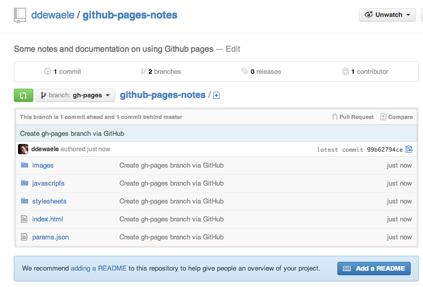

A couple of things I would like to discuss here

- Quick overview on how github pages work
- Quick overview of the automatic page generator
- Use of markdown in Github pages
- Differences between a static site and a jekyll site
- How to author static pages on your github site
- How to add Google Analytics
- How to integrate discus
- Using Jekyll on Github pages
- Discuss limitations
- Syntax highlighting

##How github pages work

Project Pages are kept in the same repository as the project they are for. 
All files are stored in the `gh-pages` branch. 

The idea is that you either use the automatic page generator to create your site. Thsi allows you generate a single-page site with a nice looking theme. Keep in mind that this only provides you with a jumpstart to get some files on the branch.
Regenerating your site will remove all previous content.

More info can be found on the [Github pages help page][0]

##Automatic page generator

This is simply a way to create a one-page website with a beautiful template of your choice. Github creates a set of static files in your repository.

##Google Analytics

https://developers.google.com/analytics/resources/concepts/gaConceptsDomains
https://developers.google.com/analytics/devguides/collection/gajs/gaTrackingSite#singleSubDirectory

	

[0]: https://help.github.com/articles/user-organization-and-project-pages
